# Jupyter Agent Dataset Generation Pipeline 🤓

The following diagram shows the pipeline used to generate the Jupyter Agent dataset.

```mermaid
graph TD
    A[Raw Kaggle Dataset<br/>~2TB ZIP files] --> B[🏁 KaggleLoader]
    B --> C[🕵️ Dedup Filter<br/>Using BigCode filelist]
    C --> D[🔄 AddMarkdownToNotebook<br/>Jupyter → Markdown conversion]
    D --> E[👨‍🎓 EduScorer<br/>AI-powered quality scoring]
    E --> F[🚫 EduFilter<br/>Filter score ≥ 4]
    F --> G[📦 ExtractPackagesAndFiles<br/>Metadata extraction]
    G --> H[🚫 RemoveNoFilesUsed<br/>Filter data-focused notebooks]
    H --> I[❓ GenerateQA<br/>Complex multi-step Q&A pairs]
    I --> J[📝 KaggleDatasetDownloader<br/>Get original Kaggle notebooks locally]
    J --> K[💻 GenerateTraces<br/>Generate synthetic notebooks with traces]
    K --> L[💾 Final Dataset<br/>JSONL format]

    subgraph "AI Models Used"
        M[Qwen3-32B<br/>For almost all LLM tasks]
        N[Qwen3-Coder-480B<br/>For traces generation]
    end
    
    E -.-> M
    G -.-> M  
    I -.-> M
    K -.-> N
```



This pipeline creates the training data that enables our Jupyter Agent to understand and execute complex data science workflows.


## 📊 Pipeline Stages

### Stage 1: KaggleLoader

* **Input**: 20 ZIP files (\~2TB, 191 total folders)
* **Process**: Extracts `.ipynb` notebooks, handles UTF-8 encoding
* **Output**: Raw notebook JSON documents

### Stage 2: Deduplication

* **Method**: Uses BigCode’s curated filelist from `bigcode/starcoder2data_extras`
* **Purpose**: Removes duplicates (90%+ in raw data)
* **Output**: Cleaned, unique notebooks

### Stage 3: Notebook Enhancement

* **Conversion**: Jupyter notebooks → structured markdown
* **Template**: Custom Jinja2 for consistent formatting

### Stage 4: Educational Quality Scoring

* **AI Model**: Qwen3-32B
* **Criteria (0–5 points)**:

  * Valid Python code (1 pt)
  * Data loading with outputs (1 pt)
  * Analysis beyond basics (1 pt)
  * Educational markdown narrative (1 pt)
  * Advanced insights & exceptional quality (1 pt)
* **Filter**: Keeps notebooks scoring ≥ 4

### Stage 5: Metadata Extraction

* **Files Used**: Detects referenced datasets, CSVs, APIs
* **Packages Used**: Extracts Python libraries via LLM prompting
* **Filter**: Removes notebooks without any data files

### Stage 6: QA Pair Generation

* **Type**: Complex, multi-step analysis questions
* **Answers**: Must be explicitly present in notebook outputs
* **Output**: Structured JSONL with metadata + one QA pair per doc
* **Example**:

  * *Q:* “What is the highest profit margin percentage achieved by any product category?”
  * *A:* “72.3%”

### Stage 7: Kaggle dataset sourcing

* **Method**: Use [Meta Kaggle](https://www.kaggle.com/datasets/kaggle/meta-kaggle/data) dataset to get dataset names, used in the original Kaggle notebooks -> download them from KaggleHub
* **Purpose**: Provide ability to get non-hallucinated outputs from code execution on real data; train model to explore locally available datasets and adapt to their format
* **Output**: Structured JSONL data with updated metadata which includes paths to locally downloaded Kaggle datasets, which can later be used for code execution in E2B sandboxes.

### Stage 8: Traces generation
* **Method**: Use [Qwen-Coder](https://huggingface.co/Qwen/Qwen3-Coder-480B-A35B-Instruct) (or another model by your choice) to generate a Jupyter notebook and answer factual questions about the provided dataset. If the dataset is locally available, then it would be loaded into E2B sandbox and the LLM-generated code would be executed there; otherwise, Qwen-Coder will simulate code execution process.
* **Output**: Structured JSONL synthetic notebooks with LLM-generated code, their traceback output and final answer for a provided QA pair.

## 📥 Data Download

First, download the raw Kaggle notebooks (\~2TB) from the [Google Cloud Storage bucket](https://console.cloud.google.com/storage/browser/kaggle-meta-kaggle-code-downloads).

### Prerequisites

* Install [Google Cloud CLI](https://cloud.google.com/sdk/docs/install-sdk)
* Have a GCP project for billing

```bash
# Authenticate with your GCP account
gcloud auth login

# Download the dataset (~2TB)
gsutil -u <GCP_PROJECT> -m cp -r gs://kaggle-meta-kaggle-code-downloads <TARGET_FOLDER>
```

## 🧪 Synthetic Data Generation

To run the processing pipeline, you need access to a Qwen3-32B model via an OpenAI-compatible API endpoint.

```bash
# Run the full pipeline
cd data
uv run main.py -r <ROUTER_IP:PORT>
```

This will use the default config in `data/main.py`.

### Step-by-Step Execution

You can also run individual stages:

```bash
# Load and deduplicate Kaggle notebooks  
uv run pipelines/kaggle_loader.py
uv run pipelines/dedup.py

# Educational scoring (requires model endpoint)
uv run pipelines/edu_scoring.py -r <ROUTER_IP:PORT>

# Metadata + QA generation (requires model endpoint)  
uv run pipelines/extract_packages_and_files.py -r <ROUTER_IP:PORT>
uv run pipelines/generate_qa.py -r <ROUTER_IP:PORT>
```